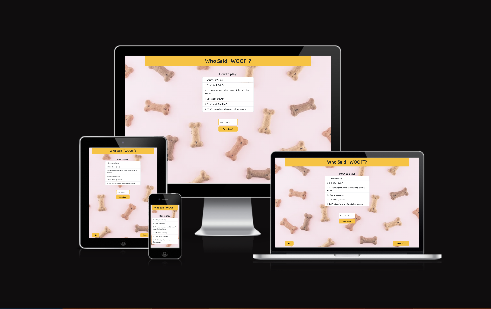
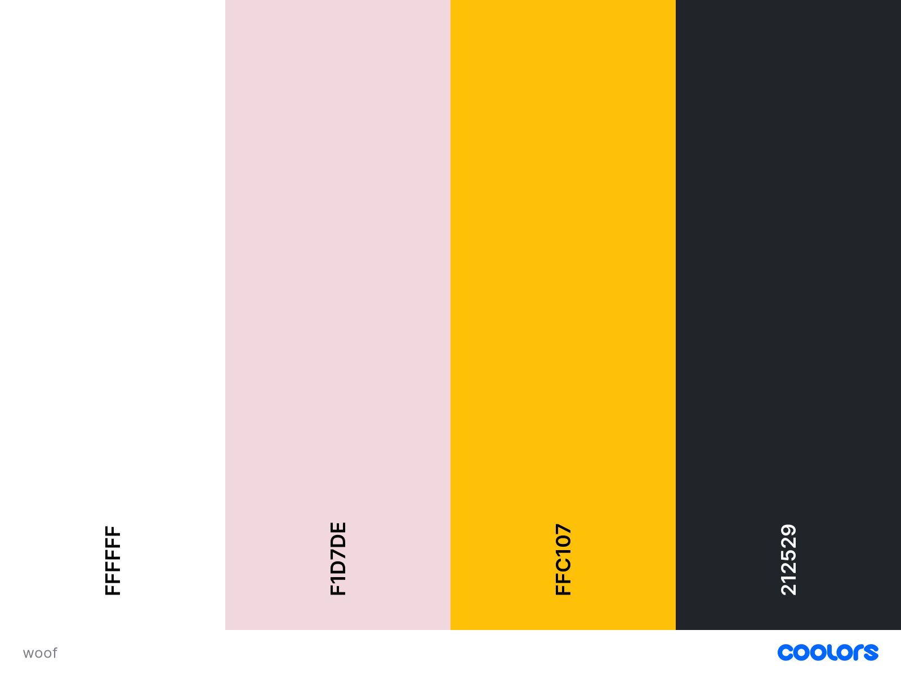
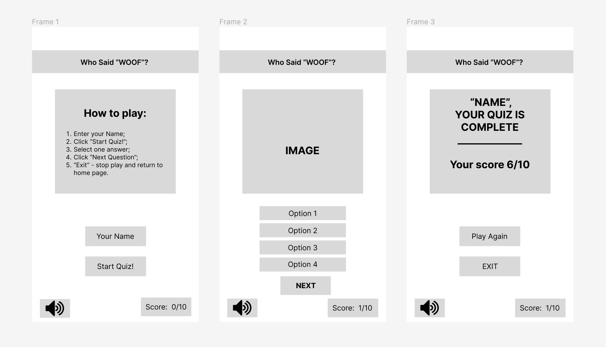
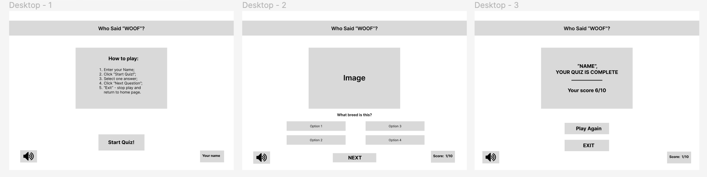
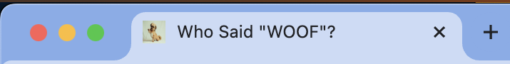
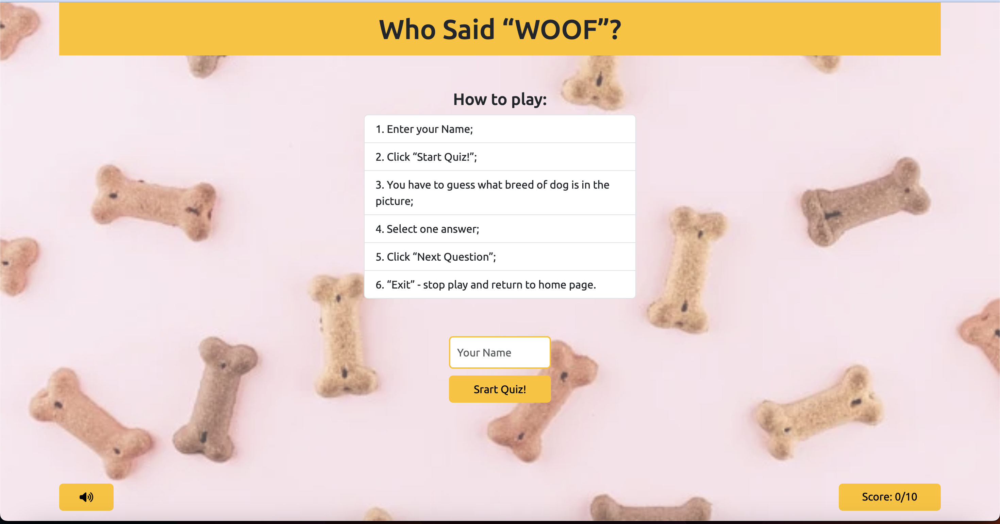
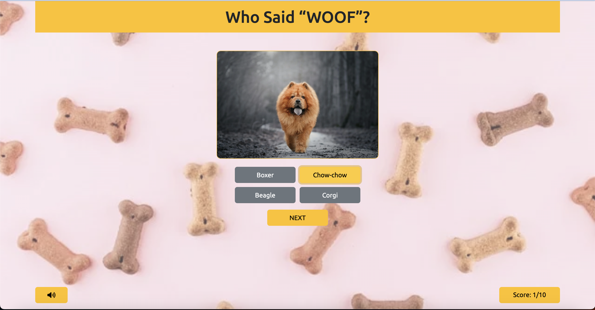
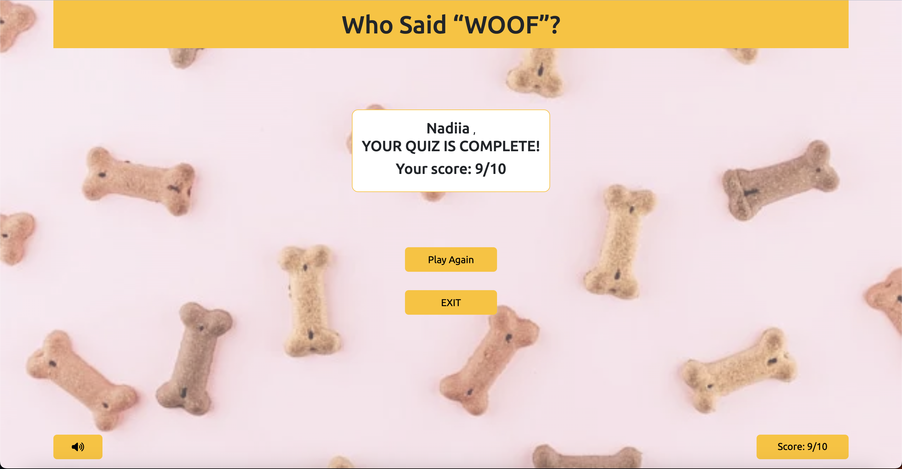

# Who said "WOOF"?

Visit the deployed site: [Who said "WOOF"?](https://liscannor.github.io/who-said-woof-quiz/)

## Goal for this Project

Welcome to the Who said "WOOF" Quiz website. The goal of the project is to check knowledge how well you know the breeds of dogs, get fun and interactive quiz with images, audio and visual effects to online users.  

## CONTENTS

- [Masters Golf Quiz](#masters-golf-quiz)
- [Goal for this Project](#goal-for-this-project)
- [Table of Contents](#table-of-contents)
- [UX](#ux)
  - [User Stories](#user-stories)
  - [Design](#design)
    - [Fonts](#fonts)
    - [Icons](#icons)
    - [Colours](#colours)
    - [Imagery](#imagery)
    - [Sounds](#sounds)
    - [Wireframes](#wireframes)
    - [Features](#features)
- [Technologies used](#technologies-used)
    - [Languages](#languages)
    - [Tools](#tools)
- [Deployment](#deployment)
    - [Fork](#fork)
    - [Clone](#clone)
- [Testing](#testing)
    - [Code Validation](#code-validation)
    - [Lighthouse](#lighthouse)
    - [Full Testing](#full-testing)
    - [Features Testing](#features-testing)
    - [User Stories Testing](#user-stories-testing)
    - [Bugs](#bugs)
    - [Unfixed Bugs](#unfixed-bugs)
- [Credits](#credits)

## UX

## User Stories

* As a user, I want the quiz to be responsive to my devices.

* As a user, I want clear instructions how to play quiz.

* As a user, I want to easily navigate through quiz.

* As a user, I want to know my score during quiz.

* As a user,  I want to know my final score with some feedback.

* As a user,  I want to have music on the site.

* As a user,  I want to have ability to switch music on and of.

- - - 

## Design

### Fonts

I have used [Google Fonts](https://fonts.google.com/ "Google Fonts") to find a text that best suits the feel of the website. For the main text I have chosen [Ubuntu](https://fonts.google.com/specimen/Ubuntu?preview=&query=ubuntu) as I feel it is has a understandable, simple and easy to read look.

### Icons

I have used icons for my website from the [Font Awesome library](https://fontawesome.com/ "Font Awesome"). These iclude the icons to give the user the option to mute and unmute the quiz sounds. 

### Colours

I have used this colour scheme: 

### Imagery

As the website is called Who said "WOOF", I wanted to use an image for the page background that was associated with the theme of dogs.

### Sounds

There is musical accompaniment through the gameplay:
- start quiz - a short sound
- correct answer - a short greeting sound
- uncorrect answer - a short sound of failure
- complete quiz - a song "Who let the dog out"

### Wireframes

Wireframes were created for mobile and desktop screens using figma.

### Features

This website is SPA (Single Page Application)  that includes: welcome screen, game screen and result screens.

All screens on the website are responsive. Page has a favicon in the browser and the title of the site at the top of pagetab.

  

  #### The Welcome screen 

    
   
   The Welcome screen represent a box with game instructions, an input for entering a username, a "strat quiz" button, a box with user's score and a button for on/off music.

  #### The Game screen 

   

  The Game screen represent: image - questions, the box with answers, a "next" button, the box with user's score and the button for on/off music.

  #### The Result screen 

   

  The Result screen represent: the result box with user's name and score, a "Play Again" button, an "Exit" button, the box with user's score and the button for on/off music.

  #### Future Implementations

  In future implementations I would like to: 
  - allow the user to go through different levels of difficulty.
  - consider not only the number of correct answers, but also the speed at which the user completes the quiz.

- - -

## Technologies Used

### Languages Used

HTML, CSS, Javascript

### Frameworks, Libraries & Programs Used

- Figma - used to produce wireframes  
- GitHub - used to save and store all files for this website  
- Git - used for version control
- GitPod - IDE used to create the site
- VS (Visual Studio Code) - IDE used to create the site
- Google Fonts - fonts were imported from here 
- Font Awesome - used for sound's icons
- Favicon.io - for badger favicon  
- Online Cloudconvert - to convert mp3 files
- Google Dev Tools - to debug and for testing responsiveness 
- Google Lighthouse - for auditing the website
- W3C Validator - for validating the HTML and CSS code 
- JSHint - for validating JavaScript
- Am I Responsive? - To show the website image on a range of devices
- Mixkit - soundes for website were imported from here 
- Bootstrap - for add styles to butttons

 - - - 

## Deployment

### Deployment

The project was deployed using GitHub by the following steps:

- Navigate to the repository on github and click "Settings".
- Then select "Pages" on the side navigation.
- In build and deployment select the "main branch".
- Select the "/(root)" folder.
- Click on the "Save" button.
- Website is now live at  `https://liscannor.github.io/who-said-woof-quiz/`. 
- If changes are made, commited and pushed to GitHub, the website will be updated.

### Fork

To make a copy of a repository or to fork it using Github follow below steps:

- Go to "Github repository" to be copied.
- Click on the "Fork" button in upper right corner of page to copy.

### Clone

To copy the repository to your local machine in Github follow steps below:

- Go to "Github repository" to be cloned.
- Click on the "Code" button above the list of files.
- Select to clone using either  "HTTPS", "SSH", or "Github CLI" and click the "copy" button to copy the URL to clipboard.
- Open "Git Bash".
- Change the current working directory to the one where you want the cloned directory.
- Type "git clone" and paste the URL from the clipboard. 
- Press "Enter" to create your local clone.

- - - 

## Testing

Testing was ongoing throughout the entire build. I utilised Chrome developer tools whilst building to pinpoint and troubleshoot any issues as I went along.
I utilised the console in the developer tools to work through small sections of JavaScript and ensure that the code was working, and also to troubleshoot where issues were.

### Code Validation

- The HTML validator returned no errors, here are the [results](assets/documentation/validation-html.png "W3C HTML").
- The CSS validator returned no errors, here are the  [results](assets/documentation/validation-css.png "W3C CSS").
- The JavaScript validator also returned no errors, here are the  [results](assets/documentation/validation-js.png "JSHint").

### Lighthouse

- The Lighthouse test for mobile [results](assets/documentation/lighthouse-mogile.png).
- The Lighthouse test for desktop [results](assets/documentation/lighthouse-desktop.png).

### Full Testing

Full testing was performed on the following devices:

* iPhone 11 Pro
* iPhone 13 Pro Max
* iPhone 15 Pro Max
* Xiaomi Redmi 10
* iPad 9 
* Laptop Mac Air M2

 The browsers used were:  
* Chrome  
* Safari

### Features Testing

- Welcome screen Features

| Feature | Testing Performed | Expected Outcome| Outcome |
| --- | --- | --- | --- | --- |
| Name Input field | Enter the user name | Name appears in box when typed | Pass |
| Start Quiz button|Moved mouse over button and clicked | If name has been entered and audio not muted a melody plays and the quiz area is dispalyed | Pass |
| Mute button | Moved mouse and clicked | Cursor changes to pointer and the muted icon appears | Pass |

- Game screen Features

| Feature | Testing Performed | Expected Outcome| Outcome |
| --- | --- | --- | --- | --- |
| Answers buttons | Click on the button | When click on the answer button, it changes colour to yellow and the correct audio is played. The score increases by one. If incorrect answer is clicked, the incorect audio is played | Passs |
| Next button | Moved mouse over and clicked | Next question and options are displayed | Pass |

- Result screen Features 

 Feature | Testing Performed | Expected Outcome| Outcome |
| --- | --- | --- | --- | --- |
| Play Again button | Moved mouse over button and clicked. | The user is brought back to the Game page when clicked | Pass |
| Exit button | Moved mouse over button and clicked. | The user is brought back to the Welcome page when clicked | Pass |

### User Stories Testing

| User Story | Testing |
| :--- | :--- | 
| As a user, I want the quiz to be responsive to my devices | The quiz was developed with responsiveness and a mobile-first mindset | 
| As a user, I want clear instructions how to play quiz | On the welcome screen there are clear instructions how to play the quiz| 
| As a user, I want to easily navigate through quiz | The welcome screen gives instructions on how to play and navigate through the quiz site |
| As a user, I want to know my score during quiz | During the quiz the score counter is displayed in the lower right corner of the screen and will increase by one if correct answer is selected and stay the same if not |
| As a user, I want to know my final score with some feedback | After the quiz is completed, the result screen is displayed, this will bring the user his results with the final score |
| As a user,  I want to have music on the site | The site provides sounds: at the start, at the correct and incorrect answer and at the end of the quiz |
| As a user,  I want to have ability to switch music on and of | The user has the ability to control the music with the on/off button |

### Solved Bugs

| No | Bug | How I solved the issue |
| :--- | :--- | :--- |
| 1 | Answers duplication for questions | Correct answer for question removed from list of possible answers before picking 3 wrong answersdesktopd. |
| 2 | "undefined" in one of the answer for second question | Answers array was not properly cloned from possible answers array, so when current answer was removed it was reduced original array and in the end there was no available answers in the array. Solved with proper array cloning. |

### Unfixed Bugs

- There are no bugs with the quiz site that I am aware of.

- - -

## Credits

### Content References

 - All content created is of my own design using copyright-free resources and is intended for educational purposes.
  - [Code Institute](https://codeinstitute.net/ie/) for their HTML/CSS/JavaScript learning material.
  - [W3Schools](https://www.w3schools.com/) for additional learning material.
  - [GoIT](https://goit.global/ua/) for additional learning material for JS.
  - [MDN Web Docs](https://developer.mozilla.org/en-US/docs/Web/JavaScript) for JavaScript best-practise, tutorials and guidance.
  - [Stack Overflow](https://stackoverflow.com/) for assistance on all my js questions.
  - [Youtube Mute button tutorial](https://www.youtube.com/watch?v=hsSXzdn_0Gg "Youtube") for mute toggle
  - [Youtube Web Dev Simplified tutorial](https://www.youtube.com/watch?v=riDzcEQbX6k "Youtube") for displaying quiz questions and options.
  - [Mixkit](https://mixkit.co/free-sound-effects/cartoon) for sound effects.
  - [Bootstrap5](https://www.w3schools.com/bootstrap5/index.php) for styling website.

  ### Acknowledgments

- I would like to acknowledge  my husband who suppoted me during this project and helped with js related problems.
- I would like to acknowledge [Amy](https://github.com/amylour/)  for her encouragement and support.

